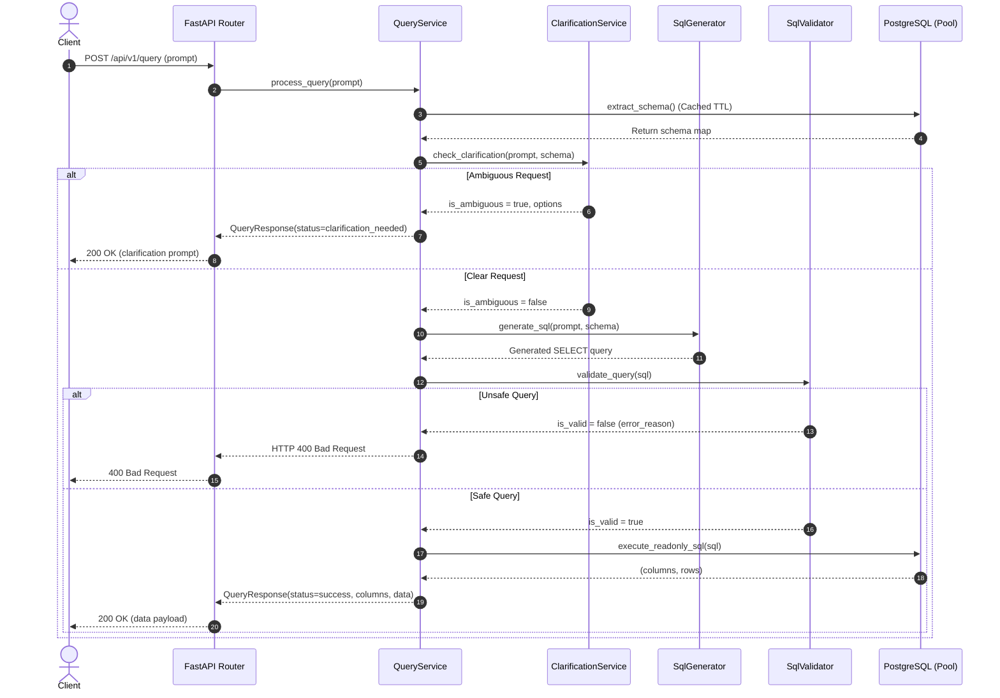

# Text-to-SQL Clarification Engine

[](https://github.com/your-org/chat-to-sql/actions)
[](https://fastapi.tiangolo.com)
[](https://python.org)
[](https://www.postgresql.org)
[](https://pytest.org)

An enterprise-grade **Text-to-SQL Clarification Engine API** engineered with **FastAPI**, **PostgreSQL**, and **sqlglot**. The platform translates natural language prompts into executable SQL queries, proactively resolves ambiguity through interactive dialogues, provides an integrated modern web chat interface, enforces multi-layered AST security policies, and executes queries within strictly read-only transactions.

---

## 🏗️ Architecture & Design Principles

The application is structured following modern domain-driven, layered architectural best practices:

```
chat-to-sql/
├── app/
│   ├── main.py                  # Application factory, lifespan, CORS & rate-limiting middleware
│   ├── core/
│   │   ├── config.py            # Pydantic-settings BaseSettings with strict validation
│   │   ├── logging.py           # Structured logging configuration
│   │   └── security.py          # Sliding-window rate limiter & optional API key verification
│   ├── db/
│   │   ├── connection.py        # Threaded connection pooling & read-only session controls
│   │   └── schema.py            # Dynamic schema introspection with TTL caching
│   ├── models/
│   │   ├── admin.py             # Pydantic models for CSV preview, ingestion & table metadata
│   │   └── query.py             # Pydantic v2 domain schemas (requests, responses, errors)
│   ├── services/
│   │   ├── clarification.py     # Morphological ambiguity detection service
│   │   ├── conversation.py      # Multi-turn chat memory & clarification resolution service
│   │   ├── csv_ingestion.py     # Schema inference, type detection & PostgreSQL bulk COPY ingestion
│   │   ├── db_explorer.py       # Multi-database introspection, schema inspector & paginated records
│   │   ├── sql_generator.py     # Schema-aware SQL generator (Google Gemini/OpenAI LLM + rule-based fallback)
│   │   ├── sql_validator.py     # AST-level query validation using sqlglot
│   │   └── query_service.py     # Orchestrator coordinating business workflow
│   ├── ui/
│   │   └── chat.py              # Self-contained modern responsive Web Chat UI & Data Studio
│   └── api/
│       ├── deps.py              # FastAPI dependency injection providers
│       └── v1/
│           ├── router.py        # API v1 aggregator
│           └── endpoints/
│               ├── admin.py     # CSV preview & streaming PostgreSQL ingestion endpoints
│               ├── health.py    # Health check & database probe
│               └── query.py     # Text-to-SQL execution endpoint
├── scripts/
│   ├── import_csv.py            # CLI tool for automated CSV to PostgreSQL ingestion
│   └── inspect_db.py            # Database schema inspection CLI utility
├── tests/
│   ├── integration/             # FastAPI TestClient API integration test suite (query, admin, battleground)
│   └── unit/                    # Unit tests for clarification, conversation, security, CSV ingestion, and AST validator
├── docker/
│   └── init.sql                 # Sample e-commerce database schema and initial data
├── .github/
│   └── workflows/
│       └── ci.yml               # Automated CI pipeline (lint, test matrix, docker build)
├── Dockerfile                   # Hardened multi-stage containerfile (unprivileged appuser)
├── docker-compose.yml           # Production-ready container orchestration
├── pyproject.toml               # PEP 518/621 tool configurations (ruff, pytest, coverage)
├── requirements.txt             # Locked production dependencies
├── .env.example                 # Comprehensive environment variable template
├── .gitignore                   # Enterprise Python & Docker gitignore
└── main.py                      # Root entrypoint
```

---

## 🔒 Enterprise Security & Defense-in-Depth

Security is enforced at multiple independent layers:

1. **AST-Level Syntax Tree Analysis (`app.services.sql_validator`)**:
   - Parses the query using `sqlglot` AST for the PostgreSQL dialect.
   - Restricts statements strictly to single `SELECT` or `WITH` queries.
   - Rejects multi-statement attacks (e.g. `SELECT 1; DROP TABLE users;`).
   - Forbids all mutation/DDL operations (`INSERT`, `UPDATE`, `DELETE`, `DROP`, `ALTER`, `TRUNCATE`, `SELECT INTO`).
   - Blocks dangerous internal functions (`pg_sleep`, `lo_export`, `dblink`, etc.).
2. **Database-Level Read-Only Transactions (`app.db.connection`)**:
   - Connection sessions are set to `SET TRANSACTION READ ONLY`.
   - Any physical mutation attempt is rejected at the database engine level.
3. **Execution Limits & Timeouts**:
   - Strict `statement_timeout` applied to prevent runaway or DoS queries.
   - Automatic `LIMIT` injection and clamping against oversized result sets.
4. **Hardened Docker Container**:
   - Built with multi-stage wheels caching.
   - Executes as an unprivileged user (`appuser`, UID 1000).

---

## ⚡ Execution Flow



---

## 🚀 Quickstart Guide

### 1. Environment Setup

Create `.env` based on `.env.example`:

```env
# Application
PROJECT_NAME="Text-to-SQL Clarification Engine API"
VERSION="1.0.0"
DEBUG=false
LOG_LEVEL="INFO"

# PostgreSQL Credentials
DB_NAME=text_to_sql_store
DB_USER=postgres
DB_PASSWORD=postgres
DB_HOST=localhost
DB_PORT=5432

# Connection Pool & Limits
DB_POOL_MIN_CONN=2
DB_POOL_MAX_CONN=10
DB_STATEMENT_TIMEOUT_MS=5000
SCHEMA_CACHE_TTL_SECONDS=300
MAX_QUERY_LIMIT=10
MAX_ALLOWED_LIMIT=100

# Google Gemini LLM Integration (Google AI Studio)
LLM_PROVIDER=gemini
LLM_BASE_URL=https://generativelanguage.googleapis.com/v1beta/openai/
LLM_MODEL=gemini-2.5-flash
GEMINI_API_KEY=
```

---

### 2. Local Installation & Development

```bash
# 1. Activate virtual environment
# Windows:
.\.venv\Scripts\Activate.ps1
# Linux / macOS:
source .venv/bin/activate

# 2. Install dependencies
pip install -r requirements.txt

# 3. Start Uvicorn development server
uvicorn main:app --reload --port 8000
```

---

### 3. Running with Docker Compose

Spin up both the PostgreSQL service (with seed data) and the API server:

```bash
docker compose up --build -d
```

Check health:
```bash
curl http://localhost:8000/health
```

---

## 🧪 Testing & Code Quality

Run the test suite with coverage report:

```bash
pytest --cov=app --cov-report=term-missing tests/
```

Run code quality & lint checks:

```bash
ruff check .
```

---

## 🗄️ Database & Ingestion Studio

ChatSQL Pro features a complete two-part administration studio, cleanly separated into dedicated workspaces:

### 1. 🗄️ Database & Table Explorer (Live Data, Schema & Deletion Controls)
- **Multi-Database Selector & Switcher**:
  - Dynamically lists all non-template databases available on the PostgreSQL cluster (`GET /api/v1/admin/databases`).
  - View real-time database status (`🟢 Active Chat DB` or `⚪ Standby DB`).
  - **1-Click Active DB Switch**: Instantly switch the application's connection pool and schema cache to any selected database (`POST /api/v1/admin/switch-db`), enabling the ChatSQL AI mentor to query the newly chosen database on the fly.
  - **Drop Database (`DELETE /api/v1/admin/databases/{database_name}`)**: Drop entire database with connection termination. Protected system databases (`postgres`, `template0`, `template1`) cannot be deleted.
- **Searchable Table Directory**:
  - Introspects all public tables in the chosen database with real-time row counts and column counts.
  - Quick-search filter for rapid navigation through enterprise schemas with dozens of tables.
- **Detailed Schema Metadata Inspector & Column Deletion**:
  - Inspects column names, PostgreSQL data types, Primary Key flags (`🔑 PK`), nullability (`YES`/`NO`), and default expressions (`GET /api/v1/admin/tables/{table}/schema`).
  - **Drop Column (`DELETE /api/v1/admin/tables/{table}/columns/{col}`)**: Drop specific column with `CASCADE` directly from the schema table.
- **Paginated Live Records Grid & Row Deletion / Truncation**:
  - Fetches and renders live data in strictly read-only mode (`GET /api/v1/admin/tables/{table}/records`).
  - Configurable page sizes (25, 50, 100 rows) with responsive `◀ Prev` and `Next ▶` pagination controls.
  - Safe type serialization for `Decimal`, `datetime`, and `UUID` types, and dedicated visual pills for `NULL` cells.
  - **Delete Specific Row (`POST /api/v1/admin/tables/{table}/rows/delete`)**: 1-click delete button on each row with primary key / parameterized WHERE condition.
  - **Truncate Table (`POST /api/v1/admin/tables/{table}/truncate`)**: Fast wipe of all table rows with schema preservation.
  - **Drop Table (`DELETE /api/v1/admin/tables/{table}`)**: Permanent drop with `CASCADE`.
- **Industry-Standard Typed Confirmation UX**:
  - High-impact destructive operations (Drop Database, Drop Table, Truncate) follow industry-standard confirmation patterns (GitHub/AWS style), requiring users to explicitly type the target database name, table name, or `TRUNCATE` before unlocking the red action button.
- **Chat Deep-Linking**:
  - Direct `💬 Query in Chat ➔` action button populates the chat prompt to immediately interrogate the selected table.

---

### 2. 📥 Automated Multi-CSV & Excel Ingestion Engine
- **Simultaneous Multi-CSV Batch Upload**:
  - Drag and drop or file-select multiple `.csv` or `.xlsx` files simultaneously.
  - File pill switcher bar enables switching schema preview and type overrides between uploaded files.
  - **1-Click "Ingest ALL Uploaded Files"**: Batch imports all uploaded files into separate PostgreSQL tables via `POST /api/v1/admin/import-multiple-csvs`.
- **Multi-Sheet Excel Support (e.g. `carDB.xlsx`)**:
  - Automatically detects all worksheets (e.g., `carCategories` and `carModels`).
  - Converts camelCase/PascalCase sheet names to idiomatic PostgreSQL snake_case tables (`car_categories`, `car_models`).
  - Interactive sheet switcher pills allow previewing columns and inferred types sheet-by-sheet.
  - 1-click **"Ingest ALL Sheets"** creates multiple relational tables in PostgreSQL simultaneously.
- **Intelligent Type Detection**:
  - Analyzes column data to infer: `BOOLEAN`, `INTEGER`, `BIGINT`, `NUMERIC`, `DATE`, `TIMESTAMPTZ`, `UUID`, `JSONB`, and `TEXT`.
  - **Leading Zero Preservation**: Protects ZIP codes, phone numbers, and IDs (e.g. `01234`) from being coerced into numbers.
- **SQL Injection Defense**:
  - Identifiers (database names, table names, and column headers) are sanitized and safely quoted using `psycopg2.sql.Identifier`.
- **Database Auto-Provisioning**:
  - If the specified target database does not exist, the engine connects to PostgreSQL and provisions it automatically.
- **High-Performance Streaming Bulk Loading**:
  - Uses PostgreSQL's native streaming **`COPY FROM STDIN WITH CSV`** protocol inside an atomic transaction (`BEGIN` -> `COPY` -> `COMMIT`), ingesting **50,000+ rows in <2 seconds**.
- **Interactive Type Overrides & Sample Preview**:
  - Admins can customize any column via type dropdowns, preview the top 5 sample rows, and choose conflict policies (`Replace`, `Fail if exists`, `Append`).

### CLI Usage
You can also run automated imports directly from the command line:

```bash
# Ingest single CSV or Excel sheet:
python scripts/import_csv.py path/to/dataset.csv --db e-commerce --table sales --mode replace

# Ingest an entire multi-sheet Excel workbook (all sheets as separate tables):
python scripts/import_csv.py path/to/carDB.xlsx --db e-commerce --all-sheets --mode replace
```

---

## 📡 API Reference

Interactive OpenAPI documentation is accessible at:
- **Swagger UI**: [http://localhost:8000/docs](http://localhost:8000/docs)
- **ReDoc**: [http://localhost:8000/redoc](http://localhost:8000/redoc)

### Key Endpoints

| Method | Path | Summary | Description |
| :--- | :--- | :--- | :--- |
| `GET` | `/` | Root Redirect | Redirects to interactive documentation (`/docs`) |
| `GET` | `/api/v1/health` | Health Check | Verifies service & PostgreSQL pool readiness |
| `POST` | `/api/v1/query` | Text-to-SQL | Translates prompt, resolves ambiguities, & runs query |
| `GET` | `/api/v1/admin/databases` | Databases List | Lists available non-template PostgreSQL databases on the server |
| `DELETE` | `/api/v1/admin/databases/{database}` | Drop Database | Drops database after terminating active client sessions |
| `GET` | `/api/v1/admin/tables` | Database Tables | Lists tables, column lists, and row counts in active or specified DB |
| `DELETE` | `/api/v1/admin/tables/{table}` | Drop Table | Permanently drops table with `CASCADE` |
| `GET` | `/api/v1/admin/tables/{table}/schema` | Table Schema | Introspects column definitions, types, nullability, defaults & PKs |
| `DELETE` | `/api/v1/admin/tables/{table}/columns/{col}` | Drop Column | Drops specific column from table with `CASCADE` |
| `GET` | `/api/v1/admin/tables/{table}/records` | Table Records | Fetches paginated live table records in read-only mode |
| `POST` | `/api/v1/admin/tables/{table}/rows/delete` | Delete Rows | Deletes rows matching condition dictionary |
| `POST` | `/api/v1/admin/tables/{table}/truncate` | Truncate Table | Wipes all rows in table while preserving schema |
| `POST` | `/api/v1/admin/switch-db` | Switch Active DB | Switches active chat DB, connection pool & invalidates schema cache |
| `POST` | `/api/v1/admin/preview-csv` | File Preview | Inspects CSV or Excel sheet, auto-detects schema & returns top 5 rows |
| `POST` | `/api/v1/admin/import-csv` | Single Ingestion | Bulk loads CSV or specific Excel sheet into PostgreSQL via streaming COPY |
| `POST` | `/api/v1/admin/import-all-sheets` | Batch Ingestion | Ingests all sheets from an Excel workbook as separate relational tables |
| `POST` | `/api/v1/admin/import-multiple-csvs` | Multi-File Batch | Ingests multiple CSV/Excel files into separate relational tables |

#### Example Query Request
```bash
curl -X POST "http://localhost:8000/api/v1/query" \
     -H "Content-Type: application/json" \
     -d '{"prompt": "Show top 5 customers by signup date"}'
```

#### Example Success Response (`200 OK`)
```json
{
  "status": "success",
  "question": null,
  "options": null,
  "generated_sql": "SELECT * FROM customers ORDER BY signup_date DESC LIMIT 10;",
  "columns": ["customer_id", "name", "email", "gender", "signup_date", "country"],
  "data": [
    [11203, "Ethan Rodriguez", "michelle92@example.com", "Female", "2025-08-30", "Solomon Islands"]
  ],
  "row_count": 1,
  "execution_time_ms": 14.2
}
```

#### Example Clarification Response (`200 OK`)
```json
{
  "status": "clarification_needed",
  "question": "Which table would you like to query?",
  "options": ["customers", "order_items", "orders", "product_reviews", "products"],
  "generated_sql": null,
  "columns": null,
  "data": null,
  "row_count": null,
  "execution_time_ms": 0.1
}
```
